# Installation de l'application

## Prérequis

- Docker
- WSL2 (Windows)

## Installation

1. Naviguez vers le dossier du projet
```bash
cd /path/to/jibaleysolution
```

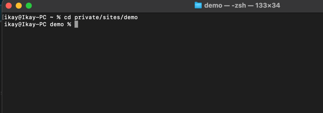

2. Lancer le script d'installation

```bash
docker compose up -d
```

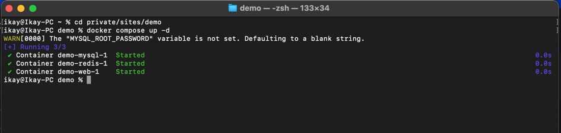

3. Accéder à l'application Docker et vous verrez le container demo en cours d'execution
   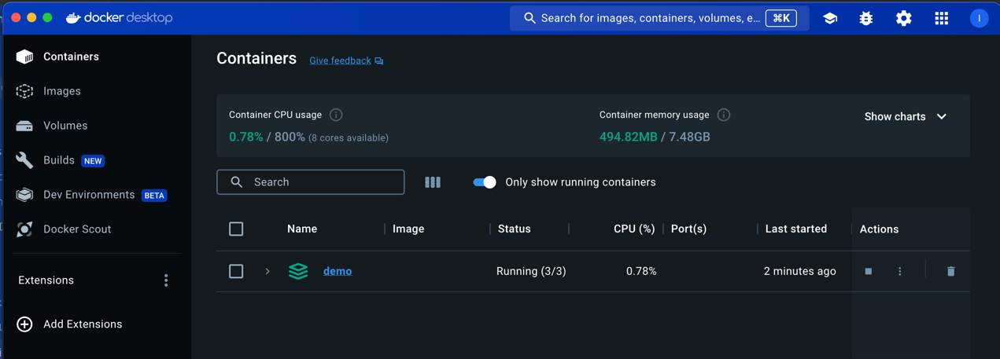

4. Cliquez sur la flèche à côté de "demo" pour afficher les conteneurs en cours d'exécution
   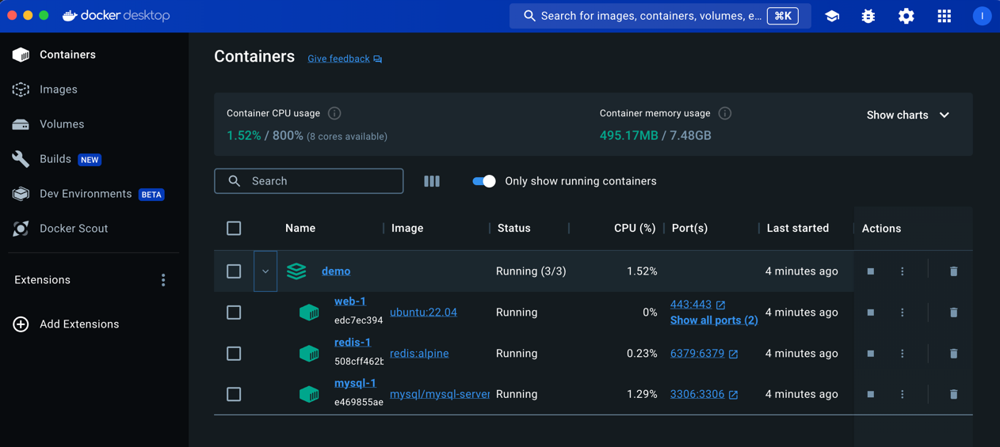

5. Cliquer sur le container web-1
   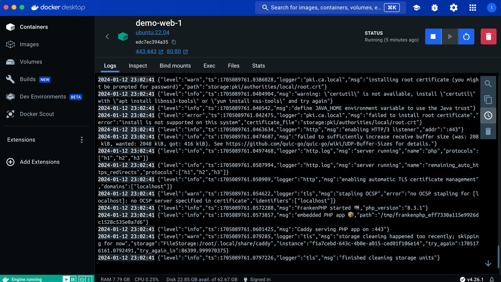

6. Cliquer sur le bouton exec et vous verrez un terminal
   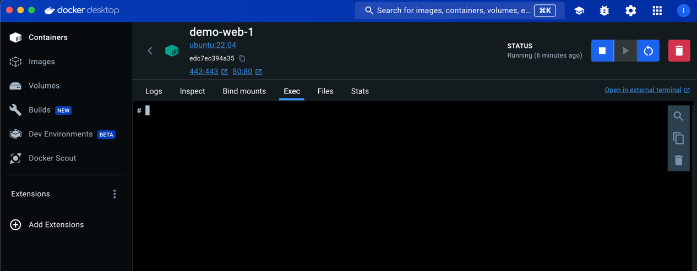

7. Executer les commandes suivantes

```bash
bash
```

et vous verrez le terminal changer ainsi
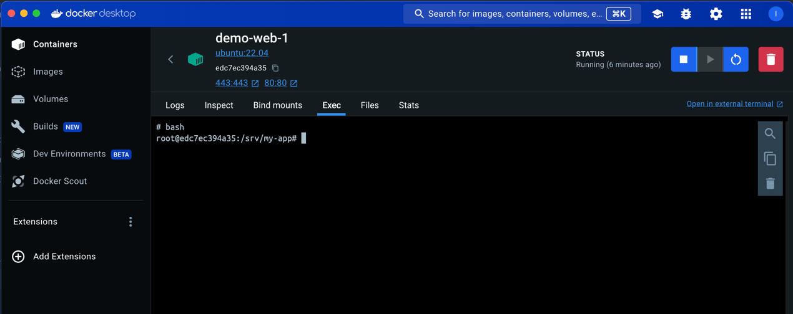

8. Executer les commandes suivantes

```bash
./my-app php-cli artisan migrate --seed
```

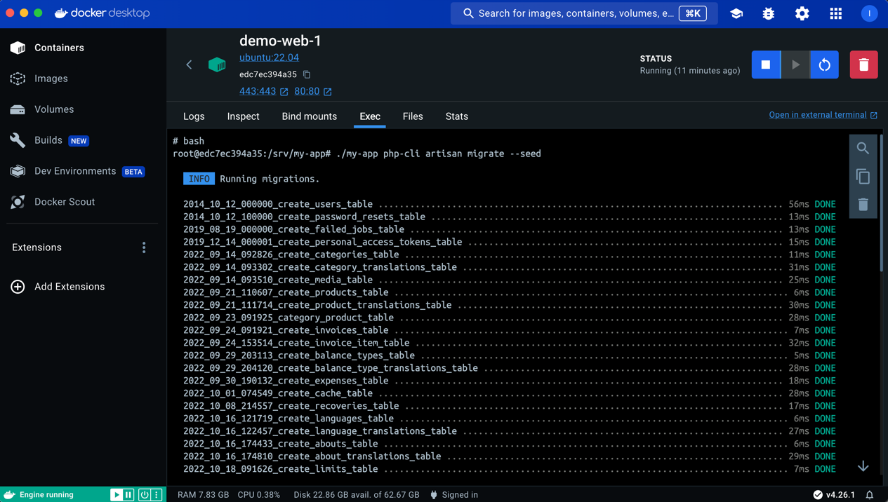
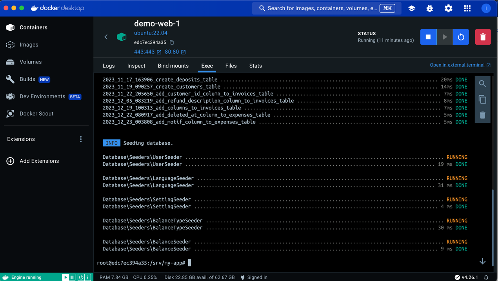
Après l'executer cette commande, vous verrez les tables de la base de données se créer et se remplir avec des données

9. Aller sur votre navigateur et entrer l'url suivante

```bash
http://localhost
```

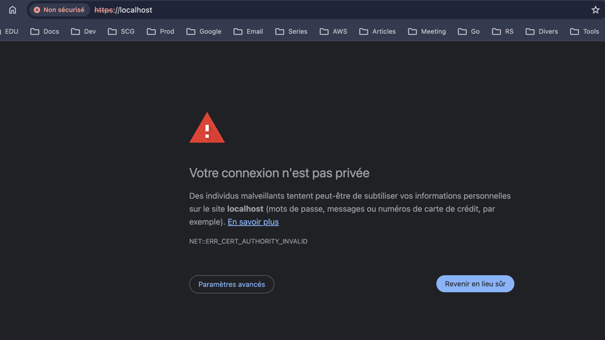
Vous verrez une page d'avertissement, cliquer sur le bouton Paramètres avancés
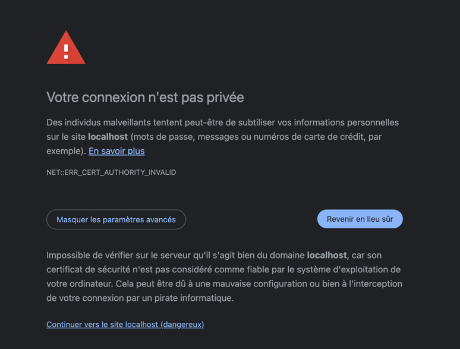

10. Cliquer sur le lien Continuer vers localhost (dangereux) et vous verrez la page connexion
    

## Connexion

Vous avez réussi à installer l'application, vous pouvez vous connecter avec les identifiants suivants :

- email : admin@app.com
- mot de passe : password

## Conclusion

Félicitations pour avoir installé l'application ! Vous pouvez maintenant l'utiliser. Si vous souhaitez fermer le
conteneur "demo," vous pouvez le faire en cliquant sur le bouton "Stop" dans l'onglet "Actions" du conteneur "demo" dans
l'application Docker. Vous pouvez le relancer en cliquant sur le bouton "Start" dans le même onglet. Vous pouvez
également fermer l'application Docker et relancer le script d'installation pour redémarrer l'application. Si j'ai oublié
quelque chose, n'hésitez pas à me le faire savoir. Merci !


